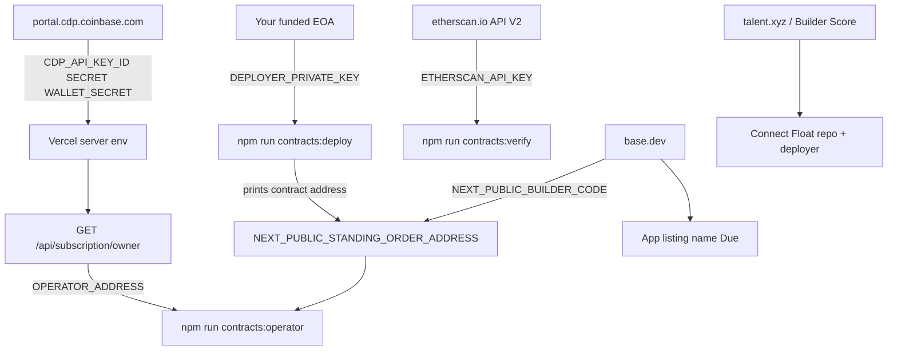

# Due — standing USDC orders for Base App

Personal control plane for Base Account users: **who can spend your USDC**, **standing orders** to pay a basename on a schedule, and **one-time pay requests**.

- **Repo:** https://github.com/philkraft1/Float
- **Live demo:** https://basea-tau.vercel.app
- **Network:** Base (`8453`)
- **Base.dev app id:** `6a8abd3739d7d26f4bad1883`

## Why this exists

Base App is full of swaps, launches, and merchant checkout. Nothing else is:

1. A daily inbox of Base Account **spend permissions** and leftover ERC-20 approvals
2. One-tap **revoke**
3. Person-to-person **recurring USDC** (rent, allowance) using spend permissions when the host allows it, with a **Pay this period** fallback when it does not

## Daily use

1. Connect Base Account or an injected wallet.
2. **Inbox** — incoming and outgoing standing orders and pay requests, plus who can still spend.
3. **New** — create a standing order to a basename, or a one-time USDC request (open or named payer).
4. **`/due/{id}`** — shareable standing-order link; payer settles the current period.
5. **`/pay/{id}`** — shareable one-time request; payer approves USDC and pays.
6. **Permissions** — list spend permissions + discovered USDC allowances; revoke.

Spend permissions inside Base App itself are still rolling out. Auto-charge is implemented; **Pay this period** is the path that always works.

## Contract

[`contracts/src/StandingOrder.sol`](contracts/src/StandingOrder.sol) — `create`, `payPeriod`, `recordPayment` (operator / CDP), `cancel`.

[`contracts/src/PayRequest.sol`](contracts/src/PayRequest.sol) — `createRequest`, `pay`. Set `NEXT_PUBLIC_PAY_REQUEST_ADDRESS` after deploy.

```bash
npm run contracts:build
npm run contracts:test
# needs Base ETH + DEPLOYER_PRIVATE_KEY
npm run contracts:deploy
# Etherscan V2 key (works for Basescan)
npm run contracts:verify
```

Then set the CDP subscription owner as operator:

```bash
node scripts/set-operator.mjs
```

Onchain counters: `GET /api/metrics`.

## Environment

See [`.env.example`](.env.example). Never commit private keys. Put deploy secrets in `contracts/.env`, app secrets in `.env.local` and Vercel. Only `NEXT_PUBLIC_*` is safe on the client.

| Variable | Where it lives | Where you get it |
|----------|----------------|------------------|
| `DEPLOYER_PRIVATE_KEY` | `contracts/.env` | Your EOA (MetaMask / Rabby / Coinbase Wallet export, or Foundry `cast wallet`). Fund it with ETH on **Base**. Not from CDP. |
| `ETHERSCAN_API_KEY` | `contracts/.env` | [etherscan.io/apidashboard](https://etherscan.io/apidashboard) (API V2; same key works for Basescan) |
| `NEXT_PUBLIC_STANDING_ORDER_ADDRESS` | `.env.local` + Vercel | Printed by `npm run contracts:deploy` (`StandingOrder: 0x…`); script also writes `.env.local` |
| `NEXT_PUBLIC_PAY_REQUEST_ADDRESS` | `.env.local` + Vercel | Deployed `PayRequest` address (verified on Base) |
| `NEXT_PUBLIC_BUILDER_CODE` | `.env.local` + Vercel | [base.dev](https://www.base.dev) → project → Settings → Builder Codes |
| `NEXT_PUBLIC_USDC_ADDRESS` / `NEXT_PUBLIC_RPC_URL` | Client (defaults exist) | Native USDC on Base + `https://mainnet.base.org` unless you use a paid RPC |
| `CDP_API_KEY_ID` / `CDP_API_KEY_SECRET` | `.env.local` + Vercel (server) | [CDP Portal](https://portal.cdp.coinbase.com) API keys |
| `CDP_WALLET_SECRET` | `.env.local` + Vercel (server) | CDP Portal → Wallets / API Wallets → Wallet Secret (separate from the API key) |
| `OPERATOR_ADDRESS` | `contracts/.env` | `address` from `GET /api/subscription/owner` after CDP is configured |
| `PAYMASTER_URL` | Server, optional | CDP Paymaster |
| `CRON_SECRET` | Vercel | You invent this; Vercel Cron sends `Authorization: Bearer` |
| `BASE_NOTIFICATIONS_API_KEY` | Server, optional | Base Notifications API |

Never put CDP secrets or the deployer key in `NEXT_PUBLIC_*` vars.

## Ship steps 1–6 (where each value comes from)

Do them in order. Steps 2, 5, and 6 are not env vars.




1. **`DEPLOYER_PRIVATE_KEY`** — hex private key of an EOA you control (`0x` + 64 hex chars) in [`contracts/.env`](contracts/.env). Fund that address with a little ETH on Base. Optional: `BASE_RPC_URL`.
2. **Deploy + verify** — `npm run contracts:deploy` then `npm run contracts:verify` (needs `ETHERSCAN_API_KEY`). The deploy script is [`scripts/deploy-standing-order.mjs`](scripts/deploy-standing-order.mjs).
3. **`NEXT_PUBLIC_STANDING_ORDER_ADDRESS`** (output of step 2) and **`NEXT_PUBLIC_BUILDER_CODE`** (base.dev Settings → Builder Codes) in `.env.local` and Vercel → Settings → Environment Variables.
4. **CDP trio** on Vercel (server only) and `.env.local`. Redeploy / `npm run dev`, then `GET /api/subscription/owner` → that `address` is `OPERATOR_ADDRESS`. Put it in `contracts/.env` and run `npm run contracts:operator`. Without `CDP_WALLET_SECRET`, auto-charge stays off; **Pay this period** still works.
5. **Base.dev listing** — dashboard paste, not an env var. Same project as app id `6a8abd3739d7d26f4bad1883`. See the table below.
6. **Talent** — [talent.xyz](https://talent.xyz): Basename, human checkmark, score ≥ 40, connect GitHub [philkraft1/Float](https://github.com/philkraft1/Float) and the **same deployer wallet as step 1**. After mainnet, create / pay / revoke on Due so Talent sees txs on your verified `StandingOrder`.

## Setup

```bash
npm install
cd contracts && forge install foundry-rs/forge-std --no-git && cd ..
npm run dev
```

## Base.dev listing (paste)

Register / update the project at [base.dev](https://www.base.dev). Discovery no longer uses `farcaster.json`.

| Field | Value |
|-------|--------|
| Name | Due |
| Tagline | Standing USDC between people, plus a spend-permission inbox |
| Description | See every spender that can take your USDC, revoke in one tap, and create person-to-person standing orders (rent / allowance) to a basename. Auto-charge when Base Account spend permissions are available; otherwise pay each period from the share link. |
| Category | finance |
| Primary URL | https://basea-tau.vercel.app |
| Icon | `/app-icon.svg` or `/due.svg` |
| Screenshots | Inbox, New order, Permissions, `/due/{id}` |
| Builder code | paste from Base.dev Settings |

## Talent / weekly ETH wiring

Eligibility is on **you**, not the app: Basename, Talent Builder Score ≥ 40, human checkmark, OFAC-clean wallet.

Ranked activity this repo is meant to produce:

1. **Public GitHub quality** — keep [github.com/philkraft1/Float](https://github.com/philkraft1/Float) public; connect it on Talent.
2. **Verified mainnet contract activity** — users must transact with **our** `StandingOrder`, not only USDC / SpendPermissionManager. Deploy, verify, then create / pay / revoke for real.
3. **Base App usage** — this listing on [base.dev](https://www.base.dev), builder code on every write (`NEXT_PUBLIC_BUILDER_CODE` + ERC-8021 suffix).
4. **Share** — cast the live demo after mainnet ship. Connect the deployer wallet on Talent.

Do not wash volume. Talent does not pay for a Sepolia-only tutorial.

## Metrics to track (grants / weekly rewards)

| Metric | Why |
|--------|-----|
| Orders created / paid | Core usage (`GET /api/metrics`) |
| Unique payers / payees | Real users + onboarding |
| USDC volume through `payPeriod` / charge | Economic activity |
| Permission and allowance revokes | Safety hygiene |
| Permission-inbox opens | Retention loop |

## Stack

Next.js · wagmi · viem · Base Account · Foundry · TanStack Query · CDP subscriptions
